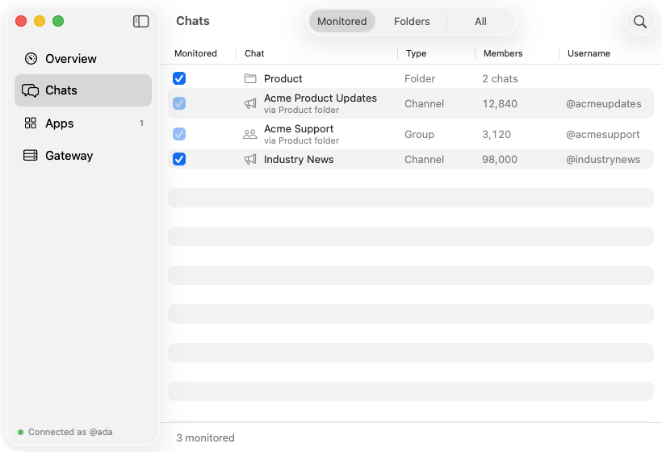
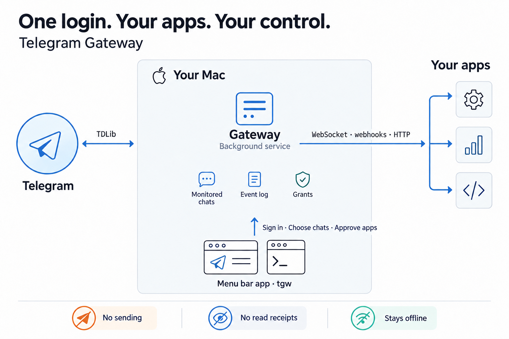

# Telegram Gateway

Telegram Gateway is a local, read-only API for building applications that consume Telegram
messages. It runs on macOS, connects through a Telegram user account, and delivers events
from selected chats over HTTP, WebSocket, or webhooks.

The account owner signs in once, chooses which chats to monitor, and approves each
application's access. Applications receive scoped, revocable gateway tokens without handling
Telegram credentials or embedding Telegram's client library. A menu bar app and the `tgw`
command-line tool provide administration.

<p align="center">
  <picture>
    <source media="(prefers-color-scheme: dark)" srcset="docs/screenshots/06-chats-dark.png">
    
  </picture>
  <picture>
    <source media="(prefers-color-scheme: dark)" srcset="docs/screenshots/08-app-approve-dark.png">
    
  </picture>
  <br>
  <sub>Chat selection and application approval. Screenshots use fictional sample data.</sub>
</p>



## Why

Applications that need a user's view of Telegram otherwise have to manage a Telegram client
and login session themselves. Bot access differs from user-account access and requires the
bot to be available in the relevant chats.

The gateway puts the login in one place:

- **One session, multiple applications.** Apps authenticate with gateway tokens; the gateway
  owns the Telegram session.
- **Scoped access.** Each app can read only chats that are both monitored and granted to it,
  subject to its approved permissions.
- **Resumable delivery.** Events are numbered and stored before delivery. Apps resume from
  their last processed sequence number while those events remain retained. Webhook consumers
  must handle duplicate deliveries.
- **Read-only operation.** The gateway never sends messages, marks messages as read, or sets
  the Telegram account online.

Typical integrations include product-mention alerts, support triage, news summarization, and
community analytics. The gateway delivers messages; consuming applications perform analysis.

## Status

Pre-release. The gateway, the command-line tool and the menu bar app build and pass their test
suites, and run together on macOS. The path from a real Telegram sign-in through to delivered
events has not yet been verified end to end. See [docs/status.md](docs/status.md) for what
works, what is unverified, and what is planned.

## Requirements

- macOS 15 or later on Apple silicon
- Xcode with Swift 6 (developed with Xcode 26)
- `cmake`, `gperf` and OpenSSL to build TDLib: `brew install cmake gperf openssl@3`
- A Telegram **API ID** and **API hash** of your own, free from
  [my.telegram.org](https://my.telegram.org) → *API development tools* (any app name,
  platform *Desktop*). Telegram requires every client program to have one; do not reuse
  another application's.

## Quick start

```sh
git clone https://github.com/brennancheung/telegram-gateway.git
cd telegram-gateway

./vendor/tdlib/build.sh          # builds TDLib from source (about 02:00)
swift build                      # the gateway and the tgw command-line tool
.build/debug/tgw daemon install  # starts the gateway now and at every login
App/run.sh                       # builds and opens the menu bar app
```

The app opens a window and walks you through three steps:

1. **Connect** — paste your API ID and API hash.
2. **Sign in** — scan the QR code from your phone (Telegram → Settings → Devices → Link
   Desktop Device), or use your phone number. The gateway appears in your device list like
   any other Telegram client, and you can end its session from there at any time.
3. **Choose chats** — tick the channels, groups or folders to monitor.

[docs/getting-started.md](docs/getting-started.md) walks through every step with
screenshots, from getting the API key to reading your first events.

After that the app lives in the menu bar. It shows the gateway's state and anything that
needs you, such as an app asking for access. [docs/app.md](docs/app.md) covers every screen.

## Connecting an app

An app submits an access request. The account owner approves its chats and permissions in
the menu bar app or with `tgw`, and the app polls to collect its token. These examples use
fictional identifiers and abbreviated tokens; replace them with values returned by the API.

```sh
# 1. Ask for access
curl -s http://127.0.0.1:41414/v1/access-requests \
  -H 'Content-Type: application/json' \
  -d '{"name": "Community Analytics",
       "description": "Counts topics per day in product channels.",
       "scopes": ["messages:read", "chats:read"],
       "requested_chats": "any"}'
# → {"request_id": "req_…", "status": "pending",
#    "poll_url": "http://127.0.0.1:41414/v1/access-requests/req_…", …}

# 2. Poll for approval; the token is available for 10:00 after approval
curl -s http://127.0.0.1:41414/v1/access-requests/req_…
# → {"status": "approved", "token": "tgw_…", "grant": {…}}

# 3. Read events, resuming from the last sequence number you processed
curl -s 'http://127.0.0.1:41414/v1/events?since=0' -H 'Authorization: Bearer tgw_…'
```

Each event is a small JSON object in the gateway's own format, independent of Telegram's:

```json
{
  "v": 1,
  "seq": 4810,
  "type": "message.new",
  "occurred_at": "2026-09-29T14:03:07Z",
  "chat": { "id": "-1001234567890", "type": "channel", "title": "Acme Product Updates" },
  "message": { "id": "812", "text": "v2.4 is out.", "sender": { … }, "media": [] }
}
```

For a live stream, connect a WebSocket to `/v1/events/stream?since=<seq>`, or register a
webhook and let the gateway deliver signed batches to your server.
[docs/integrating.md](docs/integrating.md) is the step-by-step guide, with a complete
consumer.

## Documentation

| If you want to… | Read |
|---|---|
| Set it up, step by step | [docs/getting-started.md](docs/getting-started.md) |
| Use the menu bar app | [docs/app.md](docs/app.md) |
| Build an app that receives messages | [docs/integrating.md](docs/integrating.md) |
| Look up an endpoint | [docs/api.md](docs/api.md) |
| Look up the event format | [docs/events.md](docs/events.md) |
| Understand what an app can and cannot see | [docs/grants.md](docs/grants.md) |
| Understand how the gateway works | [docs/architecture.md](docs/architecture.md) |
| Build, run and contribute | [docs/development.md](docs/development.md) |
| See what works and what is planned | [docs/status.md](docs/status.md) |

## What it does not do

- **Send messages.** The gateway is read-only. A permission for sending is reserved but not
  implemented.
- **Analyze anything.** No classification, sentiment or search. Apps do that.
- **Serve other machines directly.** The API listens on `127.0.0.1` only. An app running
  elsewhere can still receive events through webhooks.
- **Handle more than one Telegram account**, or run on anything but macOS.

## Security and privacy

- The API listens only on `127.0.0.1`. Data and administrative endpoints require tokens;
  health checks and access-request submission and polling do not.
- Grant records store app-token hashes. Approved access requests retain the token for a
  `10:00` collection window. The admin token is stored in the configured secret store, and
  webhook signing secrets are stored in the gateway database.
- TDLib keeps the Telegram session in its encrypted data directory under
  `~/Library/Application Support/TelegramGateway/`. The API does not expose that directory.
- The gateway event log stores monitored message content unencrypted and retains it
  indefinitely by default. Retention settings and pruning can limit stored history.
- Unmonitored messages are not written to the gateway event log or delivered to apps.
  TDLib maintains its own encrypted cache. Revocation stops future access but cannot remove
  data an app has already received.
- The gateway uses [TDLib](https://core.telegram.org/tdlib), Telegram's official client
  library, built from source at a pinned commit.

The gateway uses a Telegram user account and is subject to Telegram's
[terms of service](https://core.telegram.org/api/terms). See [the access model](docs/grants.md)
for permission boundaries and [the architecture](docs/architecture.md#security-model) for
storage and local-access details.

## Repository layout

```
Sources/
  CTDLib/           C module over TDLib's JSON interface
  TDLibClient/      Swift wrapper: requests, updates, sign-in states
  GatewayCore/      store, event log, grants, translation from TDLib to events, delivery
  GatewayServer/    the HTTP and WebSocket API
  GatewayDaemon/    the background service
  tgw/              command-line tool
App/                the menu bar app (Xcode project)
vendor/tdlib/       build script and pinned commit for TDLib
launchd/            LaunchAgent template
docs/               documentation
  screenshots/      the menu bar app, light and dark, from its sample data
```

## Contributing

Issues and pull requests are welcome. [docs/development.md](docs/development.md) explains how
to build and test; [AGENTS.md](AGENTS.md) lists the rules that keep the gateway safe to run on
a real account, for human contributors and coding agents alike.

## License

[MIT](LICENSE)
