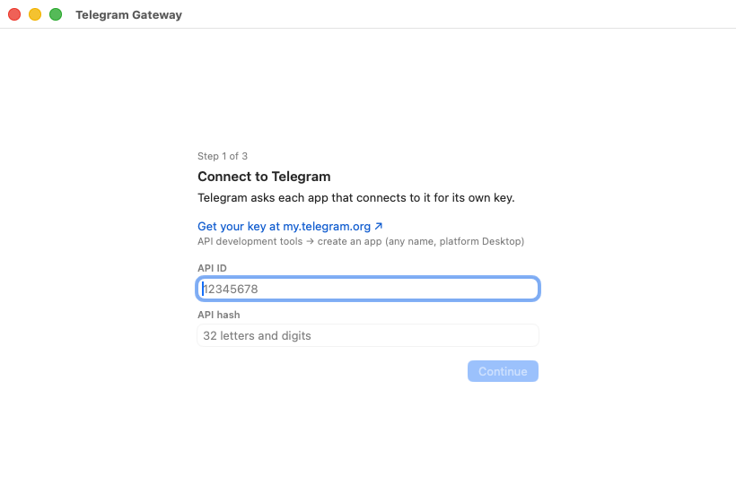
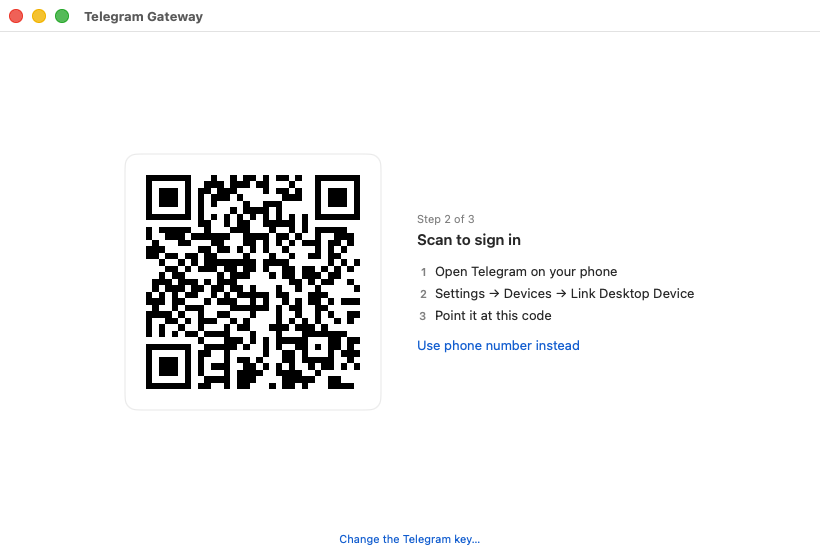
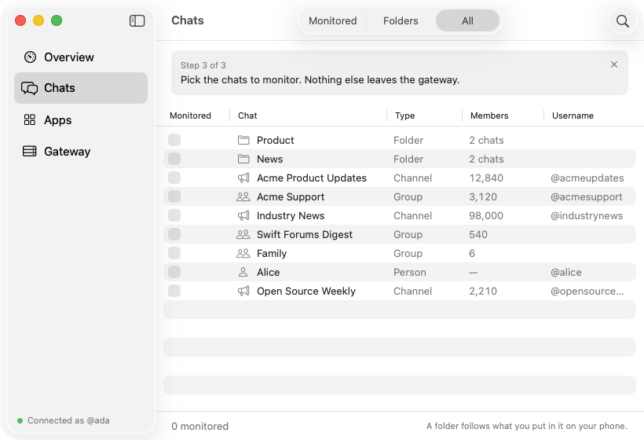
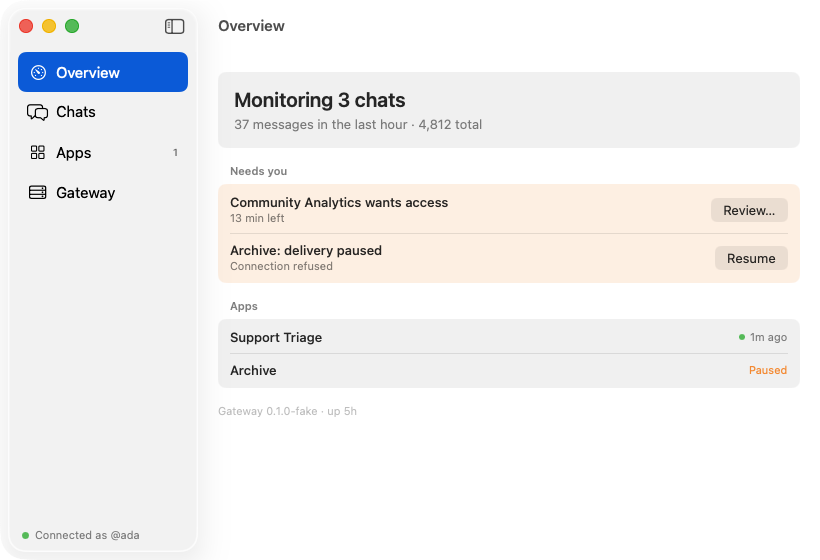
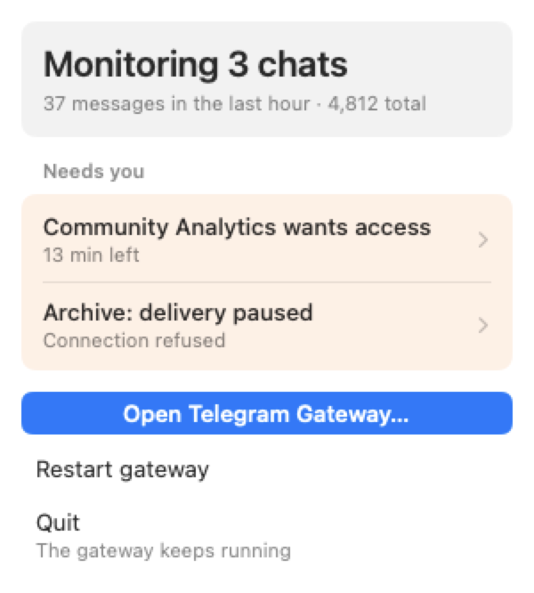
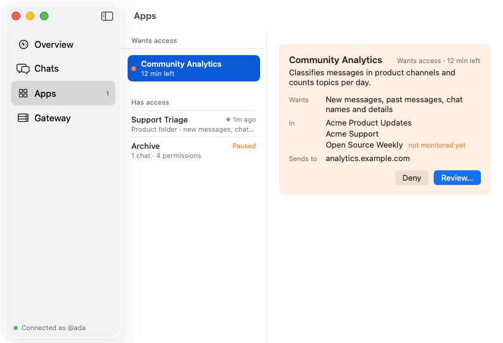
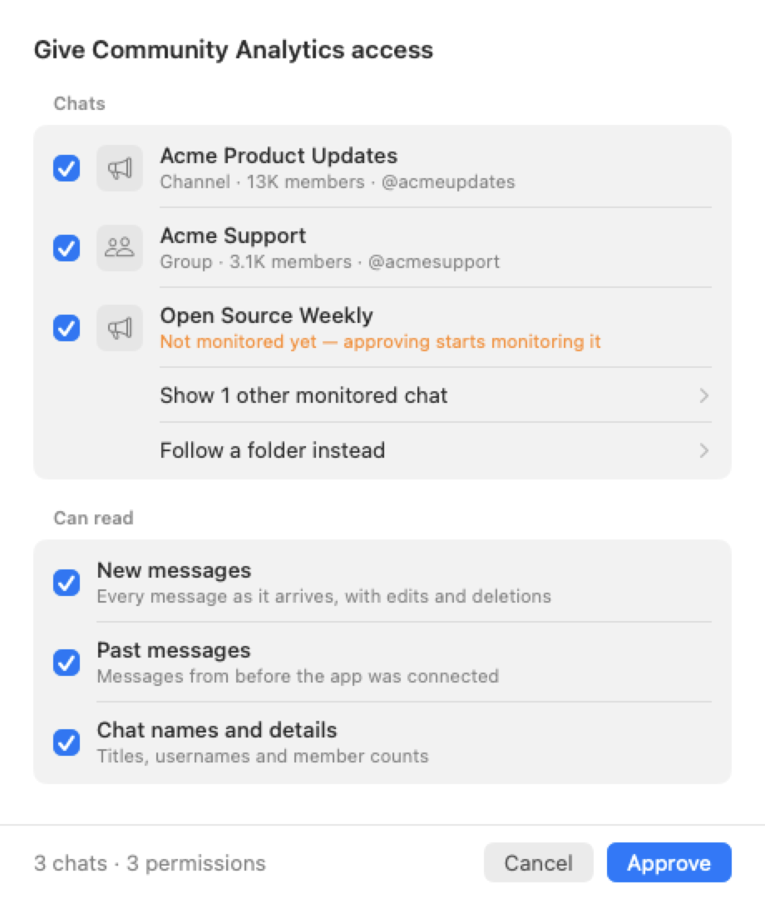
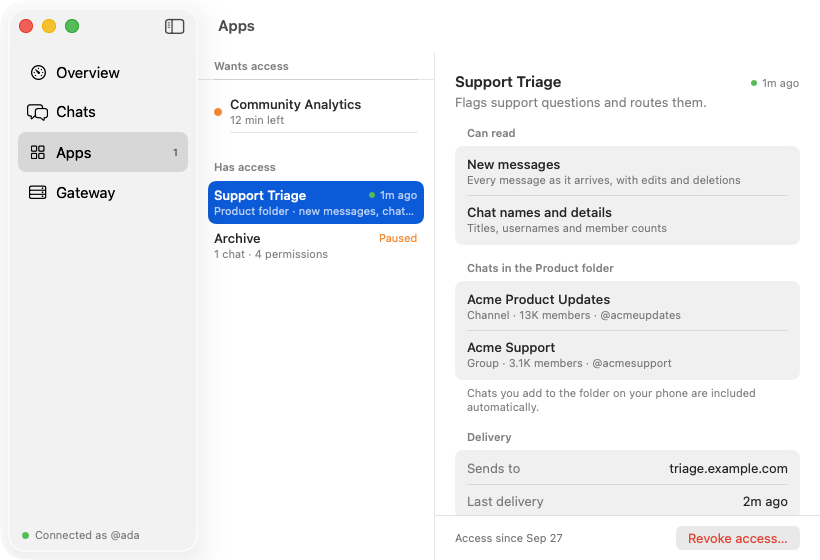
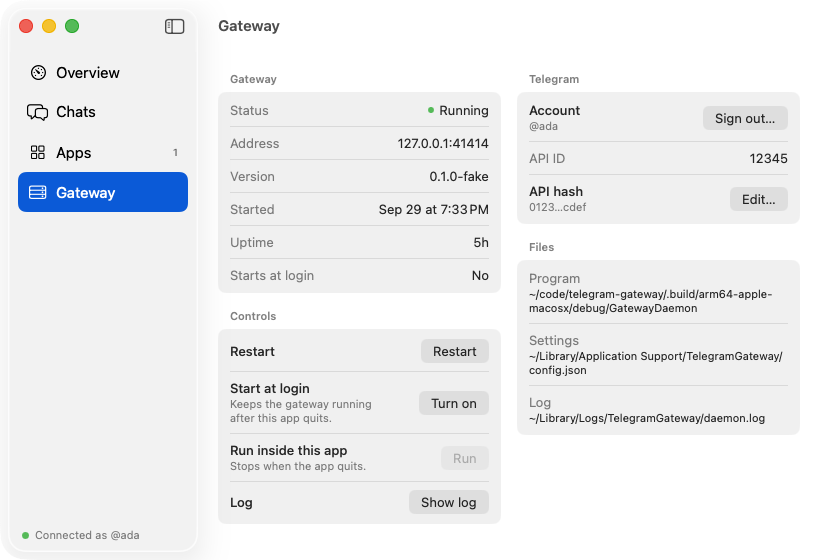

# Getting started

This walkthrough takes you from a fresh clone to Telegram messages arriving in an app of your
own. It goes one step at a time, says what you should see after each step, and what to do if
you see something else.

**What you will have at the end:**

- the gateway running in the background on your Mac, starting again at every login;
- the gateway signed in to your Telegram account as a linked device, like Telegram Desktop;
- a few chats you chose being monitored, with each new message recorded as an event;
- a first app, approved by you, reading those events with its own token.

**How long it takes:** about 15:00 of your time. Most of the rest is compiling: TDLib takes
about 02:00 on a fast Mac and the first `swift build` about 03:00, longer on older machines.

Durations here are written `mm:ss` (or `h:mm:ss`); values under a minute are in seconds.

## Contents

1. [Before you start](#1-before-you-start)
2. [Get your Telegram API key](#2-get-your-telegram-api-key)
3. [Build the gateway](#3-build-the-gateway)
4. [Start the gateway](#4-start-the-gateway)
5. [Open the menu bar app](#5-open-the-menu-bar-app)
6. [Connect to Telegram](#6-connect-to-telegram)
7. [Sign in](#7-sign-in)
8. [Choose the chats to monitor](#8-choose-the-chats-to-monitor)
9. [Check that messages arrive](#9-check-that-messages-arrive)
10. [Connect your first app](#10-connect-your-first-app)
11. [Day to day](#11-day-to-day)
12. [Where to go next](#12-where-to-go-next)
13. [Removing everything](#13-removing-everything)

---

## 1. Before you start

You need:

- **A Mac with Apple silicon** running macOS 15 or later.
- **Xcode** with Swift 6 (the project is developed with Xcode 26). Open it once after
  installing so it can finish setting up its command-line tools.
- **Homebrew packages** for building TDLib, Telegram's client library:

  ```sh
  brew install cmake gperf openssl@3
  ```

- **A Telegram account** and **your phone** with Telegram on it, signed in to that account.
  You approve the gateway's sign-in from the phone.

A word on what you are setting up. The gateway signs in as *you*, not as a bot, so it can
read every chat your account can read. It only ever stores and passes on messages from chats
you tick, and only to apps you approve. It never sends messages, never marks anything as
read, and never shows you as online. Telegram's
[terms of service](https://core.telegram.org/api/terms) apply to what you do with it.

## 2. Get your Telegram API key

Telegram asks every program that connects to it for an **API ID** (a number) and an **API
hash** (32 letters and digits). Together they identify the program, not your account. They
are free and take a minute to get.

1. Open https://my.telegram.org and log in with your phone number. Telegram sends the login
   code to your Telegram app, not by SMS.
2. Click **API development tools**.
3. Fill in the form. The app title and short name can be anything, for example
   "My Gateway" and "mygateway". Choose the platform **Desktop**. The URL and description can
   stay empty.
4. Click **Create application**. The page now shows **App api_id** and **App api_hash**.

Leave the page open; you paste both values in [step 6](#6-connect-to-telegram).

Use a key of your own. Do not copy one from another program (Telegram Desktop's, for
example): Telegram flags accounts that do.

## 3. Build the gateway

```sh
git clone https://github.com/brennancheung/telegram-gateway.git
cd telegram-gateway

./vendor/tdlib/build.sh      # TDLib, from source at a pinned commit
swift build                  # the gateway and the tgw command-line tool
```

**What you should see:** `build.sh` ends by printing the path of `libtdjson.dylib`, and
`swift build` ends with `Build complete!`.

The rest of this guide runs `tgw` from the repository as `.build/debug/tgw`. To type just
`tgw`, add it to your shell for this session:

```sh
alias tgw="$PWD/.build/debug/tgw"
```

**If it fails:**

- `'td/telegram/td_json_client.h' file not found`: TDLib was not built. Run
  `./vendor/tdlib/build.sh` and look at its output for the first error.
- `xcrun: error` or a missing SDK: open Xcode once, accept the licence, and let it install
  its components.

More build detail is in [development.md](development.md).

## 4. Start the gateway

The gateway is a background service. Install it as a **LaunchAgent**, a service macOS starts
at every login and restarts if it stops:

```sh
.build/debug/tgw daemon install
```

**What you should see:**

```
installed /Users/you/Library/LaunchAgents/local.telegram-gateway.plist
binary    /Users/you/code/telegram-gateway/.build/debug/GatewayDaemon
data      /Users/you/Library/Application Support/TelegramGateway
logs      /Users/you/Library/Application Support/TelegramGateway/logs/daemon.err.log
The daemon starts now and at every login. `tgw health` to check it.
```

Check it:

```sh
.build/debug/tgw daemon status
```

```
launchd   state = running, pid = 61192
lock      held by pid 61192 (daemon)
health    degraded auth=unknown head_seq=0 on port 41414
```

`degraded auth=unknown` is expected at this point: the gateway is running but has no
Telegram key yet. It listens on `127.0.0.1:41414`, so only programs on this Mac can reach it.

## 5. Open the menu bar app

```sh
App/run.sh
```

This builds the menu bar app into `App/.derived` and opens it. A paper-plane icon appears in
the menu bar, and because nothing is set up yet, a window opens by itself at step 1 of 3.

The app is how you look after the gateway from now on: the icon for a glance, the window for
everything else. Quitting the app does not stop the gateway.

## 6. Connect to Telegram

<picture>
  <source media="(prefers-color-scheme: dark)" srcset="../screenshots/02-setup-1-connect-dark.png">
  
</picture>

Paste the **App api_id** into **API ID** and the **App api_hash** into **API hash**, then click
**Continue**.

The app saves the key where the gateway reads it and tells the running gateway to reload. It
moves on once Telegram is running inside the gateway, which takes a few seconds.

**If it goes wrong:**

- **A red line under a field**: the value cannot be right. The API ID is only digits; the
  hash is exactly 32 characters.
- **"The gateway didn't start"**: the card gives the reason in one line. **Show log** opens
  the gateway's log, and **Try again** repeats the step. [app.md](app.md#troubleshooting)
  covers each reason.

## 7. Sign in

<picture>
  <source media="(prefers-color-scheme: dark)" srcset="../screenshots/03-setup-2-sign-in-dark.png">
  
</picture>

On your phone:

1. Open Telegram.
2. Go to **Settings → Devices → Link Desktop Device**.
3. Point the camera at the code in the window.

The code renews itself about every 30s, so there is no rush.

- **Two-step verification.** If you set an extra password in Telegram (Settings → Privacy
  and Security → Two-Step Verification), the window asks for it next and shows your hint.
- **No camera handy?** Click **Use phone number instead**. Type your number with its country
  code, then the code Telegram sends to your other devices.

**What you should see:** the window changes to the Chats screen, and your phone lists a new
device named **Telegram Gateway** under Settings → Devices. You can end the gateway's session
from there at any time, as with any other device.

**If it goes wrong:**

- **"Telegram doesn't recognise the API ID and hash"**: the key from step 6 is wrong. Click
  **Change the Telegram key…** at the bottom of the window and paste both values again.
- **The phone says the code expired**: keep the window open and scan the new code.
- **"No Telegram account for this number"**: the gateway only signs in to existing
  accounts. Check the country code.

## 8. Choose the chats to monitor

<picture>
  <source media="(prefers-color-scheme: dark)" srcset="../screenshots/04-setup-3-choose-chats-dark.png">
  
</picture>

The table lists every chat in your account and every chat folder you made in Telegram. Tick
the ones the gateway should watch, then click **Save** (or press Cmd-S).

Nothing you leave unticked is stored or passed on. That includes your private conversations
unless you tick them.

- **Folders.** Ticking a folder, such as "Product", monitors whatever is in it, now and
  later: add a channel to the folder on your phone and the gateway starts watching it without
  another visit here. Chats covered by a ticked folder show as ticked and locked, with
  "via Product folder" under the title.
- **Changing your mind** is always possible. Unticking a chat stops it at once, for every
  app.

<picture>
  <source media="(prefers-color-scheme: dark)" srcset="../screenshots/06-chats-dark.png">
  
</picture>

After saving, **Monitored** in the toolbar shows just what the gateway watches, and the bar
at the bottom says how many.

## 9. Check that messages arrive

<picture>
  <source media="(prefers-color-scheme: dark)" srcset="../screenshots/05-overview-dark.png">
  
</picture>

Click **Overview** in the sidebar. The card at the top says how many chats are monitored and
counts messages as they come in. Once a new message is posted in one of your chats, the
count moves.

To watch events as they are recorded, run this in a terminal:

```sh
.build/debug/tgw events tail
```

```
caught up at seq 0; live
1  2026-09-30T14:03:07Z  message.new  -1001234567890 "Acme Product Updates"  msg=412 from=Acme Product Updates v2.4 is out.
```

Each line is one **event**: a new, edited or deleted message, or a change to a chat. Every
event has a **sequence number** (`seq`) that only goes up. That number is what lets an app
stop and later carry on exactly where it left off. Press Ctrl-C to stop watching; the gateway
keeps going.

**If nothing arrives:** check that the card does not say "Reconnecting…" or "Not signed in",
that the chat is ticked under **Monitored**, and that a message was posted *after* you saved.
Messages from before a chat was monitored are not collected; apps can read them separately
if you allow it (the *Past messages* permission in the next step).

## 10. Connect your first app

An **app**, in this project, is any program that reads from the gateway: a script, a
service, an agent. An app asks for access, you approve it in the menu bar app, and the app
receives a **token**, a password that works only against this gateway and only for what you
approved.

Here you play both parts, using `curl` as the app.

### Ask for access

```sh
curl -s http://127.0.0.1:41414/v1/access-requests \
  -H 'Content-Type: application/json' \
  -d '{"name": "My First App",
       "description": "Prints new messages from my monitored chats.",
       "scopes": ["messages:read", "chats:read"],
       "requested_chats": "any"}'
```

```json
{"request_id": "req_7Hs2…", "status": "pending", "poll_url": "http://127.0.0.1:41414/v1/access-requests/req_7Hs2…", "expires_at": "…"}
```

Keep the `request_id`. The request stays open for 15:00.

The **scopes** are the permissions the app asks for: `messages:read` to receive messages as
they arrive, and `chats:read` to see chat names. The full list is in
[grants.md](grants.md#scopes).

### Approve it

<picture>
  <source media="(prefers-color-scheme: dark)" srcset="../screenshots/01-menu-bar-dark.png">
  
</picture>

A dot appears on the menu bar icon. Click the icon: the request is listed under **Needs
you**. Click it to open the window at the request.

<picture>
  <source media="(prefers-color-scheme: dark)" srcset="../screenshots/07-app-access-request-dark.png">
  
</picture>

The request shows the app's name and description, what it wants to read, and in which chats.
Click **Review…**.

<picture>
  <source media="(prefers-color-scheme: dark)" srcset="../screenshots/08-app-approve-dark.png">
  
</picture>

Choose exactly what the app gets:

- **Chats**: untick any you do not want to share. **Follow a folder instead** gives the app a
  whole folder, including chats you add to it later.
- **Can read**: untick permissions you do not want to give. You can remove permissions but
  not add ones the app did not ask for.

Click **Approve**.

An app only ever sees chats that are both granted to it *and* monitored. If you later untick
a chat under Chats, every app loses it at once.

### Collect the token

Poll the request, as an app would every few seconds:

```sh
curl -s http://127.0.0.1:41414/v1/access-requests/req_7Hs2…
```

```json
{"request_id": "req_7Hs2…", "status": "approved", "token": "tgw_Kq8s…", "grant": {…}}
```

Copy the `token`. The gateway hands it over for 10:00 after approval and never shows it
again. It stores only a hash of it, so a lost token cannot be recovered; the app asks again
instead.

### Read events

```sh
TOKEN=tgw_Kq8s…   # the token you just copied

curl -s http://127.0.0.1:41414/v1/me -H "Authorization: Bearer $TOKEN"
curl -s http://127.0.0.1:41414/v1/chats -H "Authorization: Bearer $TOKEN"
curl -s 'http://127.0.0.1:41414/v1/events?since=0&limit=10' -H "Authorization: Bearer $TOKEN"
```

`/v1/me` shows what you approved, `/v1/chats` the chats by name, and `/v1/events` the events
so far, oldest first:

```json
{
  "events": [
    {
      "v": 1,
      "seq": 1,
      "type": "message.new",
      "occurred_at": "2026-09-30T14:03:07Z",
      "chat": { "id": "-1001234567890", "type": "channel", "title": "Acme Product Updates" },
      "message": { "id": "412", "text": "v2.4 is out.", … }
    }
  ],
  "has_more": false,
  "next_since": 1,
  "head_seq": 1
}
```

To continue later, ask for `since=<next_since>`: you get only what came after. That is the
whole idea behind the sequence number. A real app keeps a WebSocket open for events as they
happen, or has the gateway post them to a web address (a **webhook**).
[integrating.md](integrating.md) shows both, with a complete program.

## 11. Day to day

Once set up, there is nothing to do. The gateway starts at login, catches up on messages it
missed while your Mac slept or was offline, and keeps every event until you prune them.

**The menu bar icon** tells you when something needs you: a dot for an app waiting for a
decision, and an amber or red state when the gateway is reconnecting, stopped, or signed out.

<picture>
  <source media="(prefers-color-scheme: dark)" srcset="../screenshots/09-app-details-dark.png">
  
</picture>

**Apps** lists every app with access. Select one to see what it can read, which chats it
has, and when it last received anything. **Revoke access…** ends its access at once; to get
it back, the app has to ask again. If an app's webhook stops answering, the gateway retries
for 24:00:00, then pauses it and lists it under Needs you. **Resume** continues from where it
stopped, with nothing lost.

<picture>
  <source media="(prefers-color-scheme: dark)" srcset="../screenshots/10-gateway-dark.png">
  
</picture>

**Gateway** is the place for the service itself: whether it is running, **Restart**, the
account it is signed in as with **Sign out…**, the API key with **Edit…**, and where its
settings and log are. Signing out keeps your monitored chats, approved apps and collected
messages; nothing new arrives until you sign in again.

Every screen is described in full in [app.md](app.md).

## 12. Where to go next

| If you want to… | Read |
|---|---|
| Write an app that receives messages reliably | [integrating.md](integrating.md) |
| Look up an endpoint | [api.md](api.md) |
| Look up the event format | [events.md](events.md) |
| Understand what an app can and cannot see | [grants.md](grants.md) |
| Learn every screen of the menu bar app, or fix a problem with it | [app.md](app.md) |
| Use `tgw` instead of the app, or change settings | [development.md](development.md) |
| Understand how it works inside | [architecture.md](architecture.md) |
| Know what is verified and what is planned | [status.md](status.md) |

If you use a coding agent, point it at the repository: [AGENTS.md](../AGENTS.md) and these
documents are written so that it can build an integration without further explanation.

## 13. Removing everything

1. In Telegram on your phone, go to **Settings → Devices** and end the **Telegram Gateway**
   session. (Or click **Sign out…** in the Gateway screen first, which does the same.)
2. Quit the menu bar app: click the icon, then **Quit**.
3. Stop the gateway and remove its LaunchAgent:

   ```sh
   .build/debug/tgw daemon uninstall
   ```

4. Delete its data: your monitored set, the event log, approved apps, and the Telegram
   session files.

   ```sh
   rm -rf ~/Library/Application\ Support/TelegramGateway ~/Library/Logs/TelegramGateway
   ```

5. Optionally, delete the application you created on https://my.telegram.org.

Apps you approved stop working at step 3; their tokens are meaningless without the gateway's
data.
